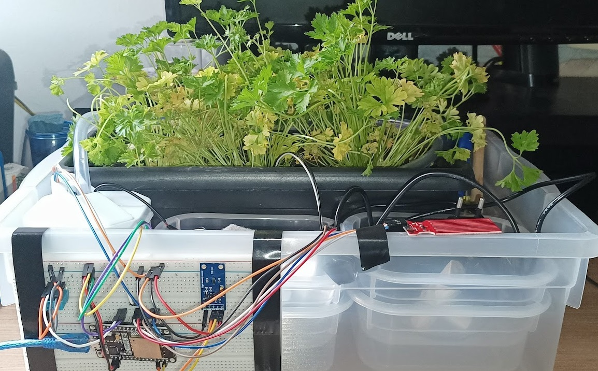

# IOT Kitchen Garden
https://docs.google.com/presentation/d/1ldtN20pnZtX3NViG3EB5WOL24Af9nZSHFJvYATVGubE/edit?usp=sharing

## Objectives

* Use sensors to monitor the environment and the soil, together with an actuator to irrigate the garden.
* Connect the ESP 32 via WI-FI, allowing the sending and receiving of messages via MQTT in a timely manner
* Creating events triggered by receiving data in MQTT
* Creation of the database to store the collected data
* Mobile interface connected with MQTT

## Components

* 1 - ESP32-DEVKIT-V1
* 2 - Small Protoboard
* 3 - DHT11 Sensor
* 4 - GY30 Sensor
* 5 - HW-038 Sensor
* 5 - Moisture Capacitive Sensor
* 6 - Hydraulic Pump 2.5-6v
* 7 - Relay Module
* 8 - 5 Volt Source

